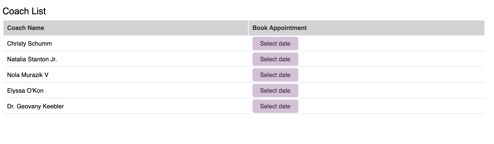
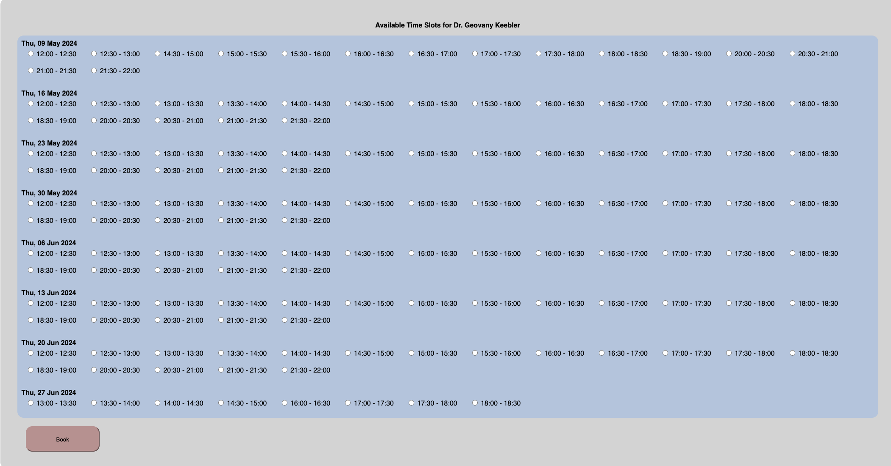
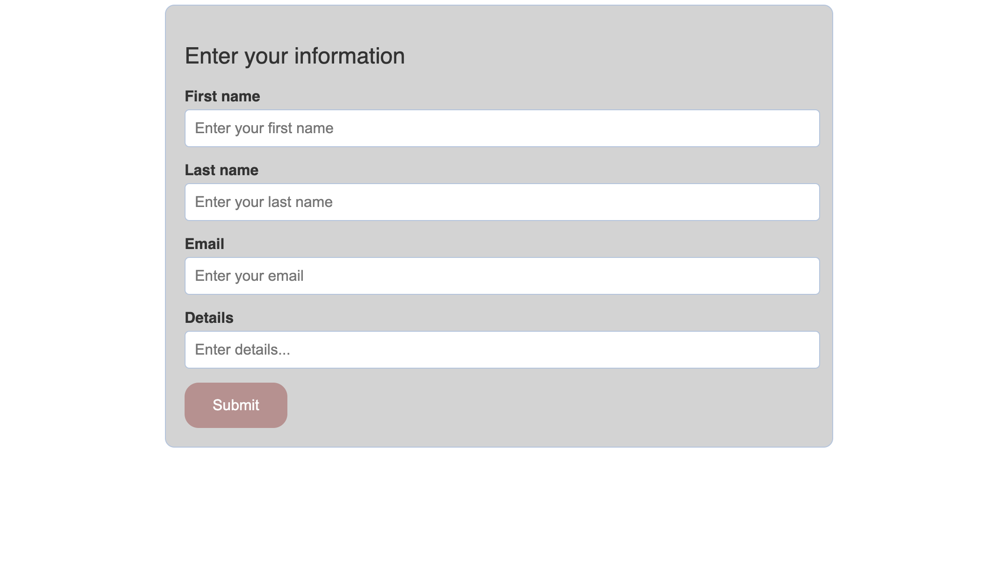

# README

# Secureframe Full Stack Take Home - README

## About the Application:
It is web application designed to facilitate appointment booking. It allows users to view available coaches, see their schedules, and book appointments with them. The application provides essential features to enable users to interact with the booking system.

## How to Run the Application:
1. Clone the repository to your local machine.
2. Navigate to the project directory.
3. Run `bundle install` to install dependencies.
4. Run `rake db:migrate` to set up the database schema.
5. Run `rake db:seed` to load coach data from the provided CSV dataset.
6. To create time slots for coaches, run `rake time_slots:create[n]`, where `n` is the number of months for which time slots should be generated.
7. Start the Rails server locally by running `rails s`.

## Screenshots:
1. **Coach List**:
   

2. **Book Time Slot**:
   

3. **User Information Form**:
   

## Developer:
- This application was developed by [Your Name] for the Secureframe Full Stack Take Home project.

## Contact:
For any inquiries or assistance, please contact [Your Email Address].
